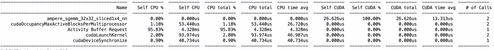

3 Matrix Multiplication 优化，做到PyTorch原生实现的3倍

<!-- more -->
首先看看baseline的效果，代码：
```python
import torch
import torch.profiler

# 准备数据
device = "cuda"
a = torch.randn(512, 512, device=device)
b = torch.randn(512, 512, device=device)
c = torch.randn(512, 512, device=device)
# 预热
for _ in range(10):
    d = a @ b @ c

# Profile
with torch.profiler.profile(
    activities=[torch.profiler.ProfilerActivity.CUDA],
    record_shapes=True,
) as prof:
    d = a @ b @ c

# 打印结果
print(prof.key_averages().table(sort_by="cuda_time_total", row_limit=10))
```

看到PyTorch用的kernel是`ampere_sgemm_32x32_sliced1x4_nn`，并调用2次:


 - `sgemm`: single float gemm
 - `32x32`: 一个 CTA 负责的子块大小
 - `sliced1x4`: 对K维做4路切分
 - `nn`: 输入矩阵在内存不做重排
很明显，可以做kernel fusion，并重新设计分块策略。
推导一下3MM的计算强度:
$$
A \times B \times C = E
$$
where $A, B, C$ are all $N \times N$.

For $ e_{ij}$:
$$
e_{ij} = \sum_{r=1}^N(\sum_{s=1}^N (a_{is}b_{sr})c_{rj})
$$
Multiple Operation: $ N^3 $
Add Operation: $ N^2+N-2 $
Read Bytes: $3N^2 \times 4~\text{Bytes}$
Write Bytes: $N^2 \times 4~\text{Bytes}$
Arithmetic Intensity: $ \frac{N^3 + N^2 + N - 2}{4N^2} \approx \frac{N}{16} $
也就是说，计算强度随着N的扩大而扩大，存在memory bound和compute bound之间的变化。

先写个naive kernel, 每个线程负责E中的一个元素的计算，每个block负责E中一行的计算，这样block内部可以用shared memory共享 $A \times B$ 的中间结果：
```
#define OFFSET(r, c, ld) ((r) * (ld) + (c))
// 第一个版本：
// Thread: 负责out中的一个元素
// Block: 负责out中的一行
// Shared Memory: 存储 A*B 的一行中间结果，为后续每个Thread计算 Out 元素服务
__global__ void mul_tri_kernel_naive(float* a, float* b, float* c, float* out, int n) {
    extern __shared__ float s_temp[];
    int col = threadIdx.x;
    int row = blockIdx.x;
    // 步骤 1: 协作计算 (A x B) 的第 row 行
    if (col < n) {
        float val = 0.0f;
        for (int k = 0; k < n; k++) {
            val += a[OFFSET(row, k, n)] * b[OFFSET(k, col, n)];
        }
        s_temp[col] = val; // 写到 shared memory
    }
        __syncthreads(); 
    // 步骤 2: 用(A x B) 的第 row 行算出 E 的第 row 行
    if (col < n && row < n) {
        float psum = 0.0f;
        for (int k = 0; k < n; k++) {
            psum += s_temp[k] * c[OFFSET(k, col, n)];
        }
        out[OFFSET(row, col, n)] = psum;
    }
}

void launch_mul_tri_naive(float* a, float* b, float* c, float* out, int n) {
    //patriton configuration here
    dim3 threads(n); 
    dim3 blocks(n);
    mul_tri_kernel_naive<<<blocks, threads, n * sizeof(float)>>>(a, b, c, out, n);
}
```

Gemini评价：

 - 总结与评分逻辑正确性：100/100
 - 工程鲁棒性：50/100 (受限于 $N \le 1024$)
 - 语法正确性：80/100 (`const`类型不匹配, 这里代码已修改)
 - 结论：只要保证测试时的`n`不超过 1024，这段代码完全可以跑通，且结果正确。

